# Signature Radio UK

[](https://stirring-florentine-d4046f.netlify.app)

**Live site:** [signatureradio.uk](https://signatureradio.uk)

*The Soundtrack Of Your Life — broadcasting on DAB+, Online and Smart Devices across Bristol, North Somerset and South Gloucestershire.*

---

## What is this?

This is the official website for Signature Radio UK. It lets listeners tune in to the live stream, send messages to the studio, see who's on air, and keep up with station news. Presenters have their own private area to monitor listener messages in real time while they're on air.

---

## Pages

### Home

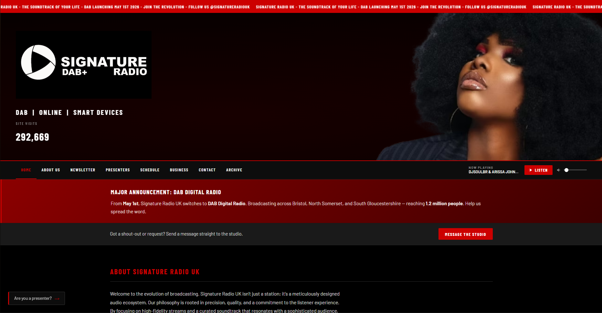

The main landing page. Contains the station logo and live visitor counter, the DAB launch announcement, a direct link to message the studio, the station's about section, and a promotional video.

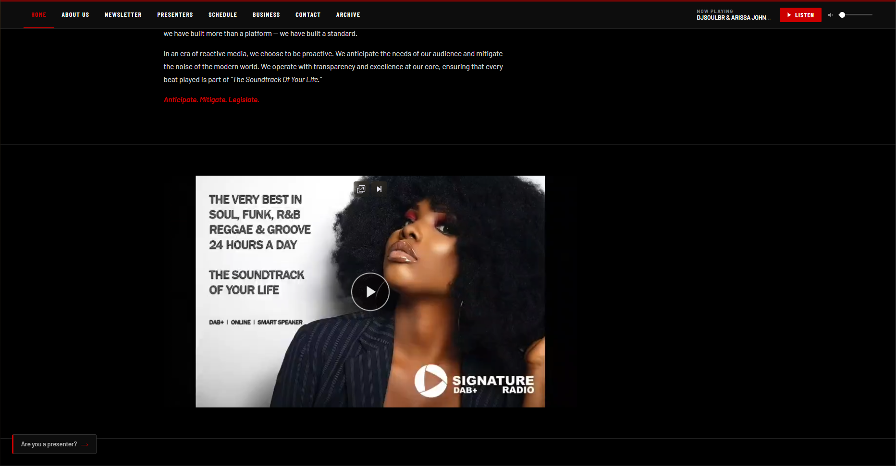

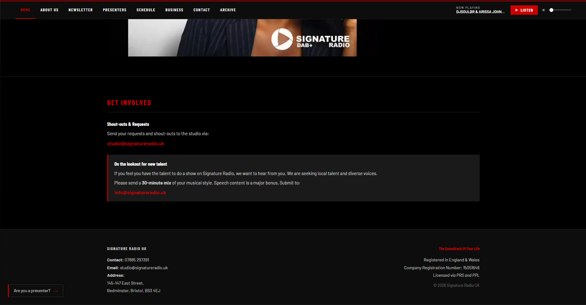

The lower section includes a talent submission callout for prospective presenters, contact details, and the footer.

---

### About Us

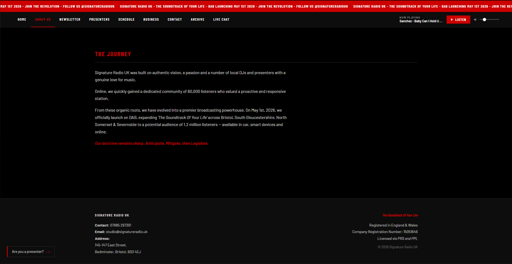

Tells the story of how Signature Radio UK was built — from its online roots with 80,000 listeners through to the DAB launch on 1st May 2026, reaching a potential audience of 1.2 million people across Bristol, South Gloucestershire, North Somerset and Severnside.

---

### Newsletter

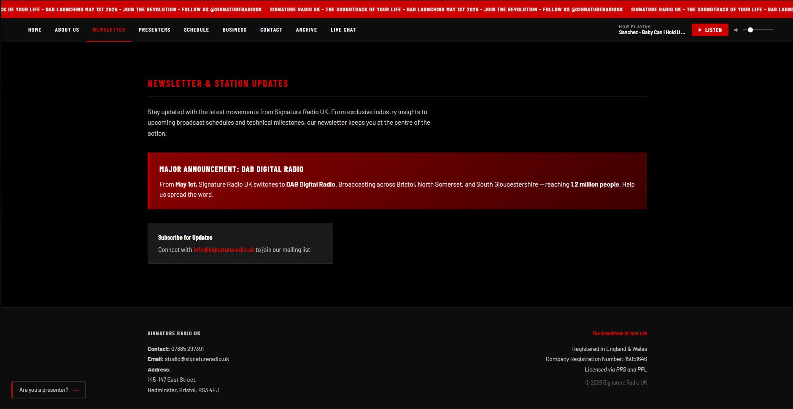

Station updates and the DAB announcement. Includes a prompt to join the mailing list via [info@signatureradio.uk](mailto:info@signatureradio.uk).

---

### Presenters

*(Coming soon — page is currently in development.)*

---

### Schedule

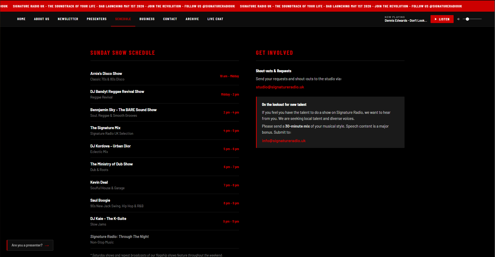

The Sunday show schedule, listing every show with its time slot and genre. Also includes the Get Involved section for shout-outs, requests, and talent submissions.

**Sunday shows:**
| Time | Show | Genre |
|------|------|-------|
| 10am – 12pm | Arnie's Disco Show | Classic 70s & 80s Disco |
| 12pm – 2pm | DJ Bandyt Reggae Revival Show | Reggae Revival |
| 2pm – 4pm | Bennjamin Sky – The BARE Sound Show | Soul, Reggae & Smooth Grooves |
| 4pm – 5pm | The Signature Mix | Signature Radio UK Selection |
| 5pm – 6pm | DJ Kordova – Urban Dior | Eclectic Mix |
| 6pm – 7pm | The Ministry of Dub Show | Dub & Roots |
| 7pm – 8pm | Kevin Deal | Soulful House & Garage |
| 8pm – 9pm | Saul Boogie | 90s New Jack Swing, Hip Hop & R&B |
| 9pm – 11pm | DJ Kaie – The K-Suite | Slow Jams |
| 11pm onwards | Signature Radio: Through The Night | Non-Stop Music |

---

### Business & Advertising

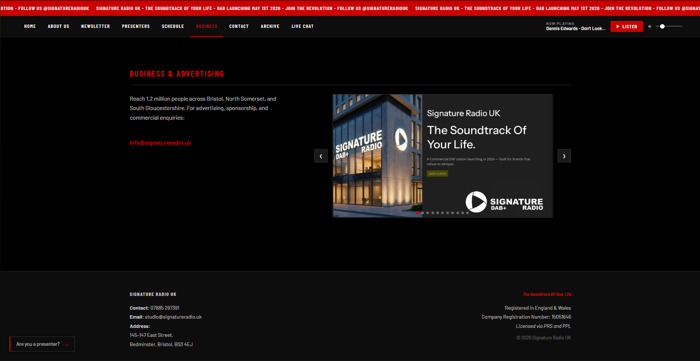

For brands and advertisers. Includes a contact email and an image slideshow showcasing the station's commercial proposition — reaching 1.2 million people across the Bristol area.

---

### Contact

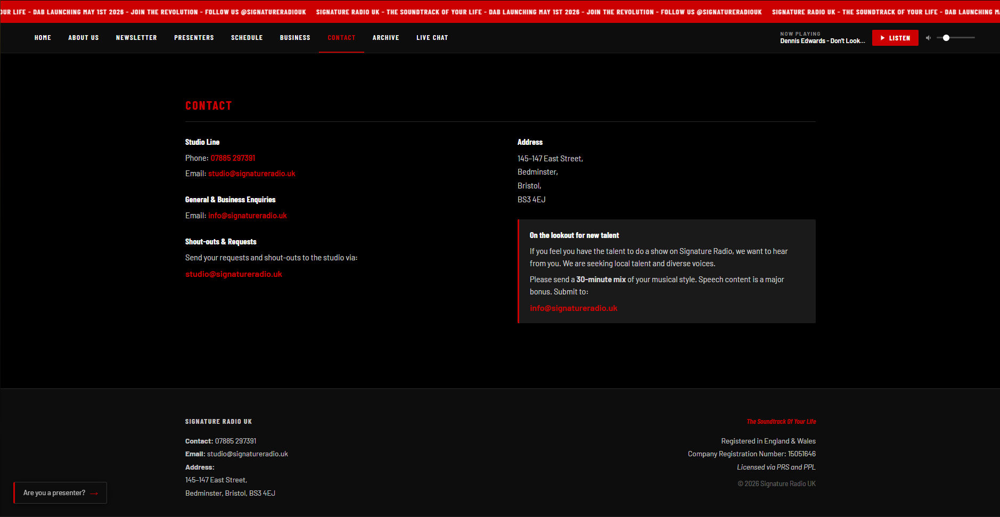

All contact details in one place: studio line, general and business enquiries, shout-outs and requests, physical address, and the talent submission box.

---

### Live Chat

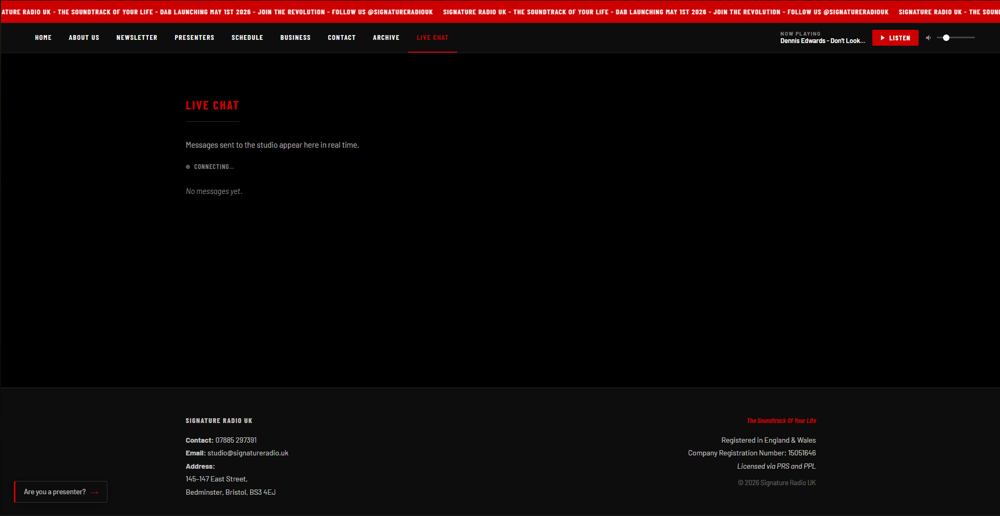

A public feed of messages sent to the studio. Anyone can view it — no login required. Messages from the last 12 hours are shown on load, and new ones appear automatically in real time. Logged-in presenters also see a Sign Out button here.

---

## Features

### Live Player

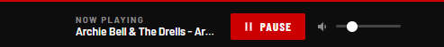

Sits in the navigation bar on every page. Shows the current track name (pulled live from the broadcast stream), a LISTEN / PAUSE button, and a volume slider. Audio continues playing uninterrupted as you navigate between pages — the player is never reloaded.

The track name updates automatically every 30 seconds. On Sundays during scheduled shows, it also displays the show name alongside the track.

---

### Message the Studio

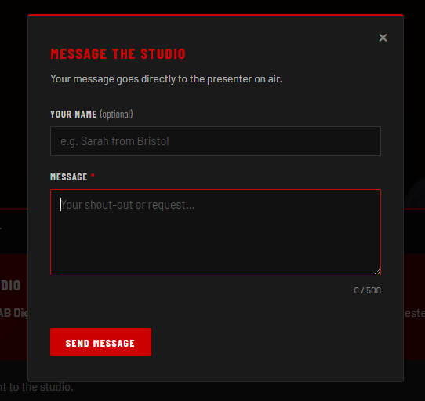

A button on the homepage opens a form where listeners can send their name (optional) and a message (up to 500 characters) directly to the studio. The message appears instantly in the presenter's Live Chat dashboard. No account needed.

---

### Presenter Bubble

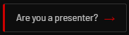

A small button in the bottom-left corner of every page. For listeners it shows "Are you a presenter?" — clicking it opens a login panel.

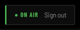

Once a presenter signs in, it changes to a green **● ON AIR** indicator with a Sign Out button.

---

### Presenter Dashboard

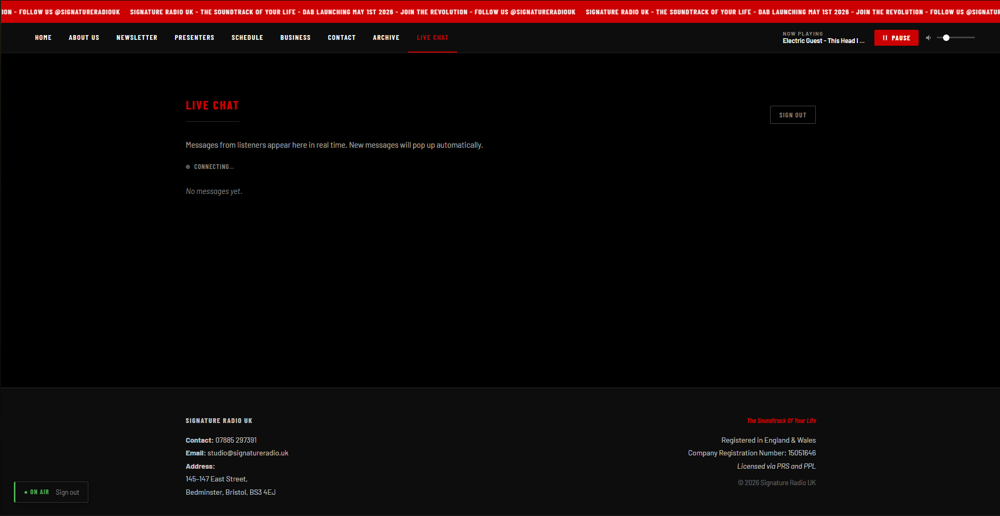

When a presenter is signed in, the Live Chat page shows a Sign Out button and receives real-time toast notifications for every new message, so they never miss one even if they're scrolled up.

---

## For Presenters

### Signing In
Click the **"Are you a presenter?"** bubble in the bottom-left corner of any page. Enter your Signature Radio email and password. Once signed in, the bubble changes to **● ON AIR**.

### Accessing the Dashboard
Navigate to **Live Chat** in the navigation bar. Listener messages appear here in real time.

### Signing Out
Click **Sign Out** in the **● ON AIR** bubble, or use the Sign Out button on the Live Chat page.

### New Presenter Accounts
New presenters are invited by email. Clicking the link in the invite email takes you directly to a password setup screen — no separate registration needed.

---

## Making Changes to the Site

All content is in plain HTML files. The files most likely to need updating are:

| What you want to change | File to edit |
|------------------------|--------------|
| Schedule / show times | `schedule.html` and `schedule-data.js` |
| Announcement banner text | `index.html` and `newsletter.html` |
| Contact details | `contact.html` and the footer in `partials.js` |
| Ticker text (the red scrolling bar) | `partials.js` — `tickerText` variable at the top |
| Business/advertising slideshow images | `business.html` |
| Station video | Replace `media/signature-radio-video.mp4` |

The schedule in `schedule-data.js` also drives the "Now Playing" show name in the player — keep both files in sync when show times change.

---

## Hosting & Services

The site runs entirely on free-tier services:

| Service | What it does |
|---------|-------------|
| **Netlify** | Hosts the website and runs the server-side functions |
| **Supabase** | Stores listener messages and handles presenter login |
| **Upstash Redis** | Stores the site visit counter |
| **Shoutcast / CentovaCast** | Provides the live audio stream and track metadata |
| **Google Fonts** | Barlow and Barlow Condensed typefaces |

---

## Technical Reference

### Stack
- Static HTML/CSS/JS — no framework, no build step
- Netlify Functions (ES modules) for server-side logic
- Supabase for auth (presenter login) and real-time database (listener messages)
- Upstash Redis for the visit counter (atomic INCR via REST pipeline)
- Shoutcast stats endpoint for now-playing metadata

### File Structure

```
/
├── index.html                  # Homepage
├── about.html                  # About Us
├── business.html               # Business & Advertising
├── contact.html                # Contact
├── newsletter.html             # Newsletter
├── presenters.html             # Presenters (in development)
├── schedule.html               # Schedule
├── presenter-dashboard.html    # Live Chat / presenter dashboard
│
├── styles.css                  # All styles
├── partials.js                 # Injects shared nav, ticker, footer, presenter bubble
├── main.js                     # Visit counter, video player, live audio player, nav toggle
├── router.js                   # SPA router — swaps <main> on navigation
├── presenter-auth.js           # Presenter login, session management, message modal
├── presenter-dashboard.js      # Live Chat — message history, real-time subscription
├── schedule-data.js            # Schedule data (shared by site and nowplaying function)
├── supabase-config.js          # Supabase public URL and anon key
│
└── netlify/
    └── functions/
        ├── counter.js          # GET /api/counter — visit counter (Upstash Redis)
        ├── message.js          # POST /api/message — submit listener message
        ├── messages.js         # GET /api/messages — fetch messages (auth required)
        ├── messages-public.js  # GET /api/messages/public — fetch last 12h (no auth)
        └── nowplaying.js       # GET /api/nowplaying — track + show metadata
```

### SPA Router
`router.js` intercepts all internal link clicks, fetches the destination page, and swaps only the `<main>` element. The nav, ticker, footer, player, and presenter bubble live outside `<main>` and are never destroyed. This keeps audio playing uninterrupted across navigation.

On each navigation the router:
1. Runs cleanup (stops slideshow timers, unsubscribes Supabase channels, closes open modals)
2. Fetches the new page and swaps `<main>`
3. Updates `document.title`, the active nav link, and scroll position
4. Re-runs page-specific initialisers (`SRUK_initSlideshow`, `SRUK_initDashboard`, `SRUK_initPresenterAuth`, `initMessageModal`)
5. For `presenter-dashboard.html`, dynamically injects `presenter-dashboard.js` if it wasn't loaded on the initial page

### Environment Variables (Netlify)

Set these in the Netlify dashboard under **Site configuration → Environment variables**:

| Variable | Used by |
|----------|---------|
| `SUPABASE_URL` | `message.js`, `messages.js`, `messages-public.js` |
| `SUPABASE_SERVICE_ROLE_KEY` | `message.js`, `messages.js`, `messages-public.js` |
| `SUPABASE_ANON_KEY` | `messages.js` (JWT validation) |
| `UPSTASH_REDIS_REST_URL` | `counter.js` |
| `UPSTASH_REDIS_REST_TOKEN` | `counter.js` |

The Supabase public URL and anon key are also set in `supabase-config.js` for browser-side use — these are safe to expose.

### Supabase Schema

**`listener_messages` table:**
| Column | Type | Notes |
|--------|------|-------|
| `id` | uuid | Primary key |
| `name` | text | Sender name (defaults to "Anonymous") |
| `message` | text | Message body, max 500 chars |
| `created_at` | timestamptz | Set automatically |

Row Level Security is enabled. The browser-side anon key cannot read rows directly — all reads go through the `/api/messages/public` Netlify function which uses the service role key server-side. Writes also go through `/api/message`.

Real-time is enabled on the table for the live dashboard subscription.

### Presenter Auth Flow
Supabase Auth handles all authentication. Presenters are invited by email. The invite token is detected in the URL hash on landing, a session is set, and the password setup panel is shown. Subsequent logins use email/password via the presenter bubble.

Session state is persisted in `localStorage` under the standard Supabase key (`sb-*-auth-token`). `presenter-auth.js` reads this synchronously on every page load to restore the logged-in UI state without waiting for the Supabase SDK to initialise.

---

## Glossary

| Term | Plain English |
|------|--------------|
| **Netlify** | The service that hosts the website and makes it available on the internet |
| **Netlify Functions** | Small programs that run on Netlify's servers rather than in the browser — used for things that need to be kept private, like database writes |
| **Supabase** | A database service that also handles logins. Stores the listener messages and presenter accounts |
| **Row Level Security (RLS)** | A Supabase setting that controls who can read or write to the database. Prevents unauthorised direct access |
| **Service Role Key** | A secret Supabase credential that bypasses RLS — only ever used server-side, never in the browser |
| **Anon Key** | A public Supabase key safe to use in the browser — its access is limited by RLS |
| **Upstash Redis** | A fast counter database used to track site visits |
| **Shoutcast / CentovaCast** | The software that runs the live radio stream and reports what track is currently playing |
| **SPA Router** | "Single Page Application" router — makes the site feel fast by only swapping the page content rather than reloading the whole browser tab |
| **Real-time subscription** | A live connection to the database that pushes new messages to the page the moment they're saved, without needing to refresh |
| **JWT** | A secure token used to prove a presenter is logged in when making requests to the server |
| **DAB** | Digital Audio Broadcasting — the digital radio standard used in the UK |
